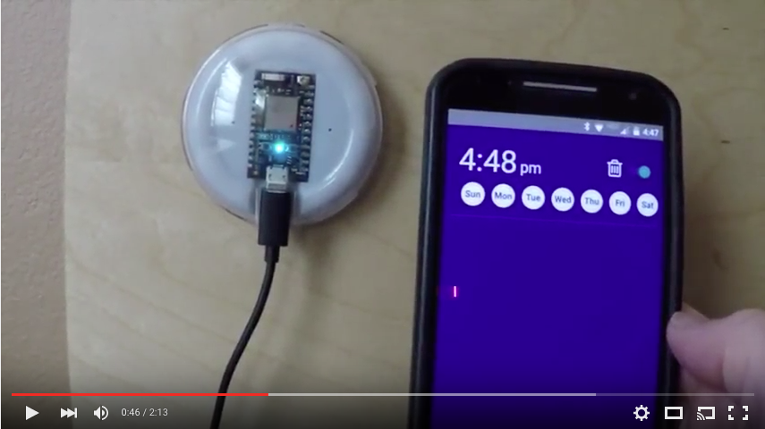

# particle-sun

A simulated sunrise alarm clock built with a [Particle Internet Button](https://www.particle.io/button)
and a [react-native](https://facebook.github.io/react-native/) app.

# Demo video

## Project construction video

 * [Core unboxing](https://www.youtube.com/watch?v=oQDl12VCCzs)
 * [Using the Tinker mobile app to control the Core device](https://www.youtube.com/watch?v=8GryUZHAc9o)
 * [Attaching an LED to the breadboard](https://www.youtube.com/watch?v=2zlG39CaMXE)
 * [Core alarm clock firmware](https://www.youtube.com/watch?v=I6jJDSIlgRU)
 * [react-native alarm clock app](https://www.youtube.com/watch?v=VTQxne7SsCU)
 * [Core alarm controlled by mobile app](https://www.youtube.com/watch?v=ehdKMnMDv8A)
 * [Internet button unboxing](https://youtu.be/wLhzdFc4cP0)
